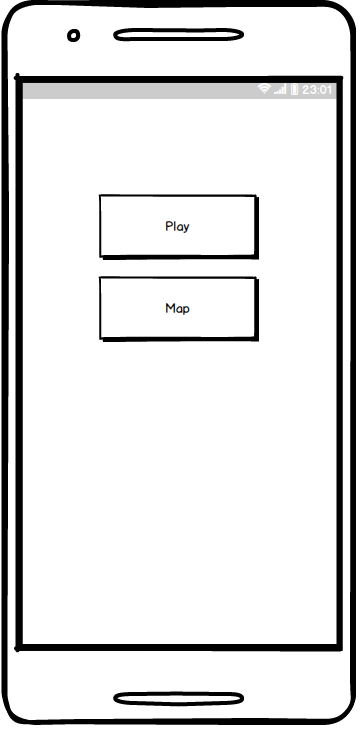
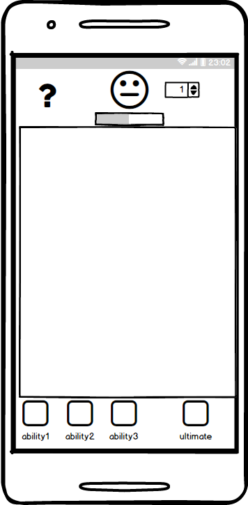
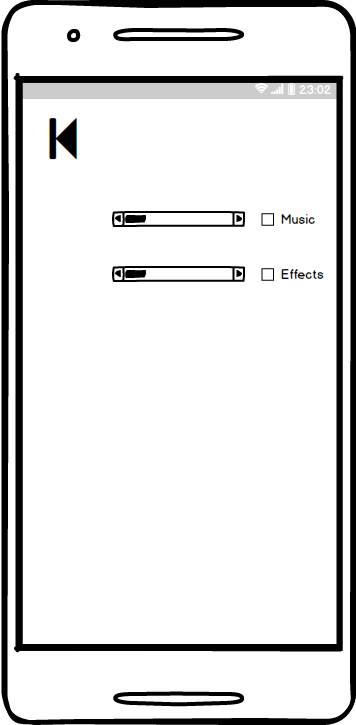

# Требования к проекту

# 1 Введение

Целью разработки является игра для мобильных устройств на ОС Android 6.0 и выше,которая будет основана на механике игр 3-в-ряд.

## Аналоги

В Google Play существует большое количество анаглогов с различными вариациями функционала.

# 2 Требования пользователя
### 2.1 Программные интерфейсы

Игра будет написана на языке Java в IDE Android Studio с использованием Google Play API.

### 2.2 Интерфейс пользователя

При входе в игру пользователь видит главное меню:

Игровой экран выглядит следующим образом:

Вкладка настроек:

### 2.3 Характеристика пользователей

Целевая аудитория приложения - любые пользователи, имеющие свободное время.
Минимальный необходимый навык - умение использовать устройство под управлением Android.

### 2.4 Предположения и зависимости

Для использования приложения необходимо соединение с интернетом. В случае его отсутствия данные о прохождении записываются в кэш.

# 3 Системные требования

Любое устройство под управлением Android 6.0 и выше с доступом к интернету, с диагональю экрана больше 4".

### 3.1 Функциональные требования

1.Авторизация
2.Синхронизация с аккаунтом Google Play
3.Рекорды уровней
4.Фиксация достижений
5.Выход из аккаунта
6.Генерация уровней

### 3.2 Нефункциональные требования
#### 3.2.1 Атрибуты качества
1.Стабильность
2.Быстродействие
